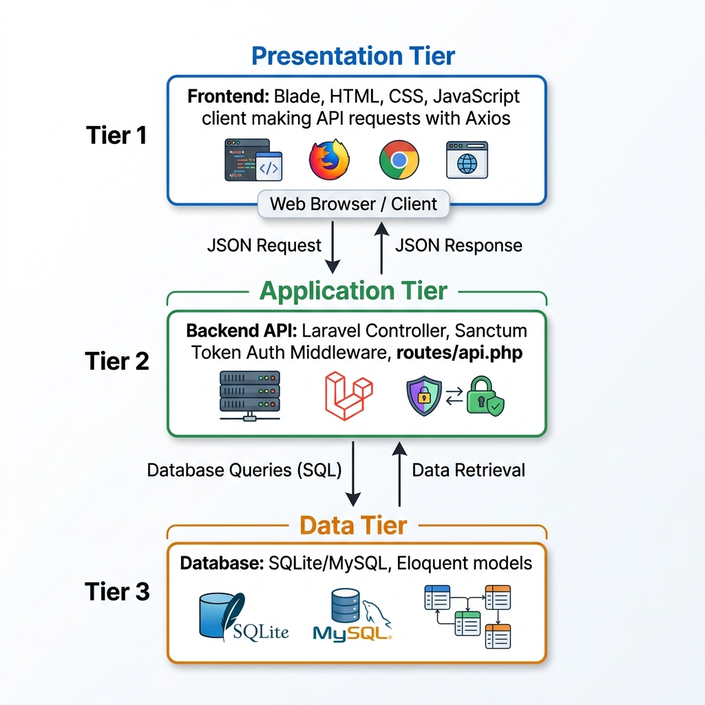
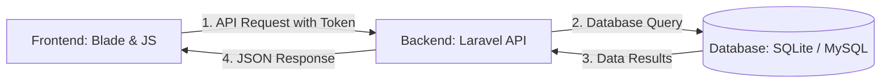

# P-FUNDS System Architecture (Simplified)

This document shows simply how the Frontend, Backend, and Database communicate in the P-FUNDS application. 

* 📐 **Editable Diagram**: [architecture_diagram.drawio](file:///c:/Users/de_gent/Desktop/P-fund/P-FUND-APIs/architecture_diagram.drawio) (Open in Draw.io)
* 📊 **PowerPoint Presentation**: [architecture_presentation.pptx](file:///c:/Users/de_gent/Desktop/P-fund/P-FUND-APIs/architecture_presentation.pptx) (Slides presentation of the architecture)

---

## 1. How It Communicates

---

## 2. The Three Layers

### 🛡️ Frontend (User Interface)
* **Visuals**: Laravel Blade views render the HTML layouts (stored in [resources/views](file:///c:/Users/de_gent/Desktop/P-fund/P-FUND-APIs/resources/views) directory).
* **API Calls**: Javascript makes async requests using Axios (configured in [api.js](file:///c:/Users/de_gent/Desktop/P-fund/P-FUND-APIs/public/assets/js/api.js)) to fetch statistics.
* **Feature Handlers**: Chat is handled in [chat.js](file:///c:/Users/de_gent/Desktop/P-fund/P-FUND-APIs/public/assets/js/chat.js) and notifications in [notifications.js](file:///c:/Users/de_gent/Desktop/P-fund/P-FUND-APIs/public/assets/js/notifications.js).
* **Session**: Auth token (`pfunds_token`) and user role are saved in browser `localStorage` on login.

### ⚙️ Backend (Application Layer)
* **Routing**: Requests from the frontend hit endpoints configured in [api.php](file:///c:/Users/de_gent/Desktop/P-fund/P-FUND-APIs/routes/api.php) and [web.php](file:///c:/Users/de_gent/Desktop/P-fund/P-FUND-APIs/routes/web.php).
* **Security Middleware**: Sanctum authenticates the user, and custom middleware checks roles (Creator, Admin, Sponsor, Vetter).
* **Controllers**: Handles request actions (located in the [Controllers/Api/V1](file:///c:/Users/de_gent/Desktop/P-fund/P-FUND-APIs/app/Http/Controllers/Api/V1) directory).

### 🗄️ Database (Storage Layer)
* **Eloquent ORM**: Maps database tables to classes located in the [Models](file:///c:/Users/de_gent/Desktop/P-fund/P-FUND-APIs/app/Models) directory.
* **Tables**: Stores user roles, project records, milestone progress, uploaded documents, and chat records.
